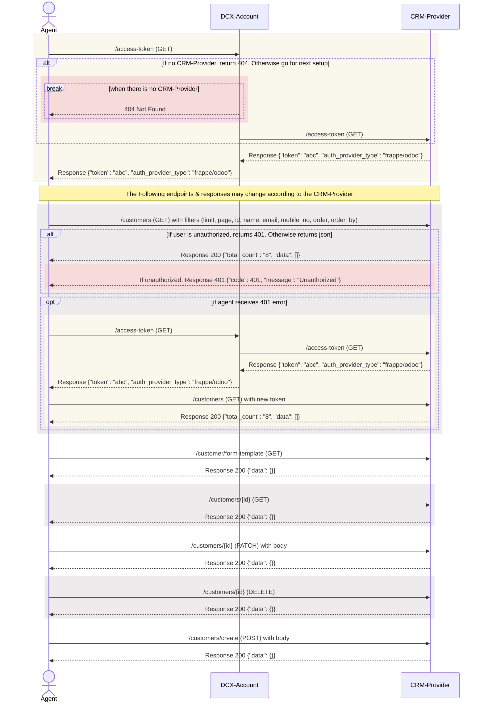
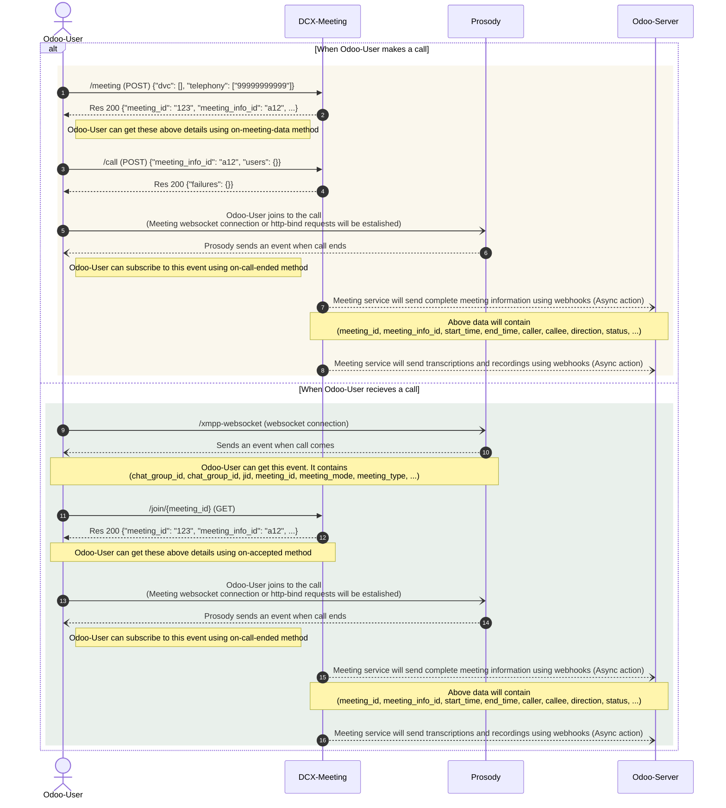

# DCX-CRM Provider Integration

```mermaid

sequenceDiagram
    actor Agent
    participant DCX-Account
    participant CRM-Provider
    
    rect rgb(250, 247, 237)
        Agent->>DCX-Account: /access-token (GET)
        alt If no CRM-Provider, return 404. Otherwise go for next setup
            rect rgb(247, 218, 218)
                break when there is no CRM-Provider
                    DCX-Account-->>Agent: 404 Not Found
                end
            end
            DCX-Account->>CRM-Provider: /access-token (GET)
        end
        CRM-Provider-->>DCX-Account: Response {"token": "abc", "auth_provider_type": "frappe/odoo"}
        DCX-Account-->>Agent: Response {"token": "abc", "auth_provider_type": "frappe/odoo"}
    end

    note over Agent, CRM-Provider: The Following endpoints & responses may change according to the CRM-Provider

    rect rgb(237, 235, 235)
        Agent->>CRM-Provider: /customers (GET) with filters (limit, page, id, name, email, mobile_no, order, order_by)
        alt If user is unauthorized, returns 401. Otherwise returns json
            CRM-Provider-->>Agent: Response 200 {"total_count": "8", "data": []}
            rect rgb(247, 218, 218)
                CRM-Provider-->>Agent: If unauthorized, Response 401 {"code": 401, "message": "Unauthorized"}
            end
        end
        opt if agent receives 401 error
            rect rgb(250, 247, 237)
                Agent->>DCX-Account: /access-token (GET)
                DCX-Account->>CRM-Provider: /access-token (GET)
                CRM-Provider-->>DCX-Account: Response {"token": "abc", "auth_provider_type": "frappe/odoo"}
                DCX-Account-->>Agent: Response {"token": "abc", "auth_provider_type": "frappe/odoo"}
                Agent->>CRM-Provider: /customers (GET) with new token
                CRM-Provider-->>Agent: Response 200 {"total_count": "8", "data": []}
            end
        end
    end


    rect rgb(255, 255, 255)
        Agent->>CRM-Provider: /customer/form-template (GET)
        CRM-Provider-->>Agent: Response 200 {"data": {}}
    end

    rect rgb(237, 235, 235)
        Agent->>CRM-Provider: /customers/{id} (GET)
        CRM-Provider-->>Agent: Response 200 {"data": {}}
    end

    rect rgb(255, 255, 255)
        Agent->>CRM-Provider: /customers/{id} (PATCH) with body
        CRM-Provider-->>Agent: Response 200 {"data": {}}
    end

    rect rgb(237, 235, 235)
        Agent->>CRM-Provider: /customers/{id} (DELETE)
        CRM-Provider-->>Agent: Response 200 {"data": {}}
    end

    rect rgb(255, 255, 255)
        Agent->>CRM-Provider: /customers/create (POST) with body
        CRM-Provider-->>Agent: Response 200 {"data": {}}
    end


```

## Call details flow

```mermaid

sequenceDiagram
    autonumber
    actor Odoo-User
    participant DCX-Meeting
    participant Prosody
    participant Odoo-Server

    alt When Odoo-User makes a call
        rect rgb(250, 247, 237)
            Odoo-User->>DCX-Meeting: /meeting (POST) {"dvc": [], "telephony": ["99999999999"]}
            DCX-Meeting-->>Odoo-User: Res 200 {"meeting_id": "123", "meeting_info_id": "a12", ...}
            Note right of Odoo-User: Odoo-User can get these above details using on-meeting-data method
        
            Odoo-User->>DCX-Meeting: <br/> /call (POST) {"meeting_info_id": "a12", "users": {}}
            DCX-Meeting-->>Odoo-User: Res 200 {"failures": {}}
    
            Odoo-User-)Prosody: <br/> Odoo-User joins to the call<br />(Meeting websocket connection or http-bind requests will be estalished)
            Prosody--)Odoo-User: Prosody sends an event when call ends
            Note right of Odoo-User: Odoo-User can subscribe to this event using on-call-ended method

            DCX-Meeting--)Odoo-Server: <br/> Meeting service will send complete meeting information using webhooks (Async action)
            Note over DCX-Meeting, Odoo-Server: Above data will contain<br />(meeting_id, meeting_info_id, start_time, end_time, caller, callee, direction, status, ...)
            DCX-Meeting--)Odoo-Server: <br/> Meeting service will send transcriptions and recordings using webhooks (Async action)
        end
    else When Odoo-User recieves a call
        rect rgb(233, 240, 235)
            Odoo-User-)Prosody: /xmpp-websocket (websocket connection)
            Prosody--)Odoo-User: Sends an event when call comes
            Note over Odoo-User, Prosody: Odoo-User can get this event. It contains <br /> (chat_group_id, chat_group_id, jid, meeting_id, meeting_mode, meeting_type, ...)

            Odoo-User->>DCX-Meeting: <br/> /join/{meeting_id} (GET)
            DCX-Meeting-->>Odoo-User: Res 200 {"meeting_id": "123", "meeting_info_id": "a12", ...}
            Note over Odoo-User, DCX-Meeting: Odoo-User can get these above details using on-accepted method

            Odoo-User-)Prosody: <br/> Odoo-User joins to the call<br />(Meeting websocket connection or http-bind requests will be estalished)
            Prosody--)Odoo-User: Prosody sends an event when call ends
            Note right of Odoo-User: Odoo-User can subscribe to this event using on-call-ended method

            DCX-Meeting--)Odoo-Server: <br/> Meeting service will send complete meeting information using webhooks (Async action)
            Note over DCX-Meeting, Odoo-Server: Above data will contain<br />(meeting_id, meeting_info_id, start_time, end_time, caller, callee, direction, status, ...)
            DCX-Meeting--)Odoo-Server: <br/> Meeting service will send transcriptions and recordings using webhooks (Async action)
        end
    end


```

